# SonarLint в EDT 2020.6

## Ограничения

* EDT 2020.5 и новее
* SonarQube сервер версии 7.9 и новее
* Плагин **1C (BSL) Plugin** версии 1.33 и новее

## Установка плагина

1. Скачиваем архив **org.sonarlint.eclipse.site-5.5.2-snapshot.zip**  с плагином со страницы релиза [SonarLint 5.5.2 с поддержкой языка 1С (beta)](https://github.com/silverbulleters/sonarlint-eclipse/releases/tag/5.5.2.24675-bsl).
2. В EDT открываем **Установить новое ПО** (Справка -> Установить новое ПО)

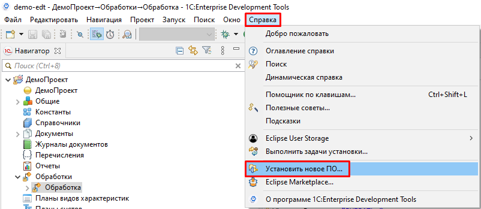

3. Теперь нужно добавить репозиторий для установки плагина. 
   * Нажимаем **Добавить (1)**.
   * В открывшемся окне заполняем поле `имя`, например "SonarLint BSL" (2). Далее нажимаем на кнопку **Архив (3)**. В диалоговом окне указываем путь к архиву с плагином **org.sonarlint.eclipse.site-5.5.2-snapshot.zip**. 
   * Завершаем добавление нового репозитория нажатием на кнопку **Добавить**.

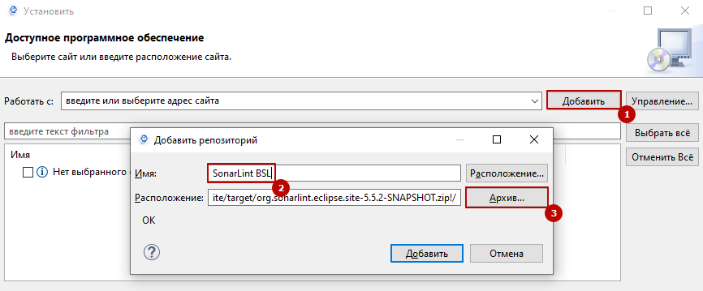

4. На форме установки нового ПО:
   * Выбираем в поле `Работать с` **SonarLint BSL (1)**. 
   * Устанавливаем флажки на всех **возможностях (2)**.
   * Устанавливаем флажок **Обращаться во время инсталляции ко всем сайтам обновлений.. (3)**.
   * Завершаем выбор нажатием на кнопку **Далее**.

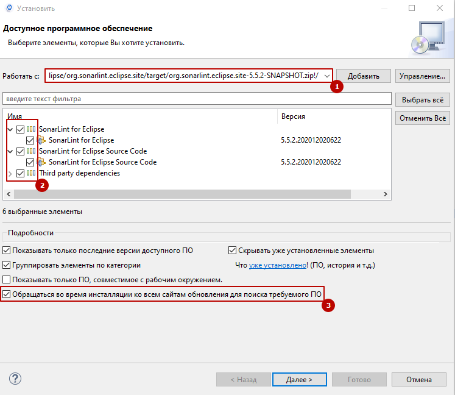

5. Подтверждаем установку. Сначала нажимаем **Далее**, затем соглашаемся с лицензионным соглашением проекта и завершаем нажатием **Готово**.
6. EDT попросит перезапустить сеанс. Нажимаем **Перезапустить**.

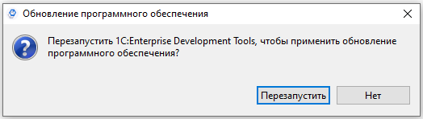

💣**Установка плагина завершена**. 

Проверить можно открыв окно **О программе** (Справка -> О программе..) и нажав на кнопку **Детали установки**.

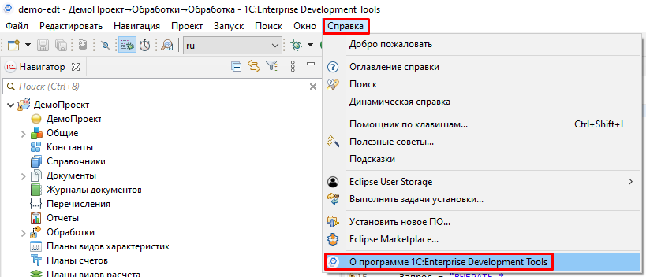

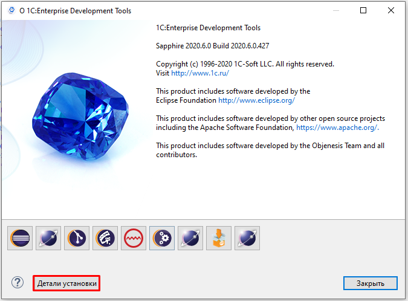

В открывшемся окне должен быть SonarLint плагин.

## Первоначальная настройка и первый анализ

1. Подготовим нужные панели плагина SonarLint. Открываем **Показать панель** (Окно -> Показать панель -> Другое..).

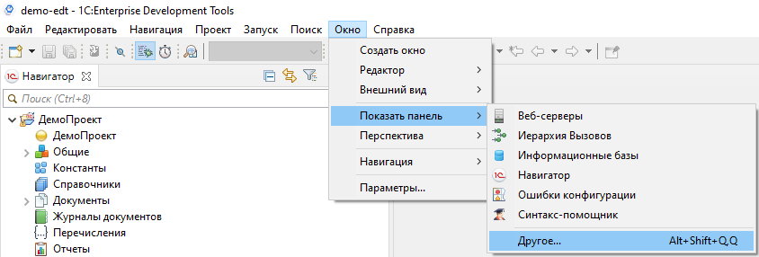

Выбираем нужные панели и нажимаем **Открыть**:

- SonarLint Bindings
- SonarLint Report

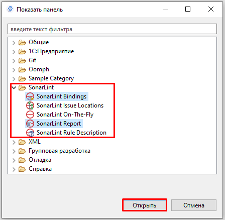

2. Подключаемся к SonarQube серверу. Для этого в панели SonarLint Bindings нажимаем на **Connect to SonarQube/SonarCloud**.

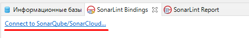

* Выбираем тип подключения `SonarQube`

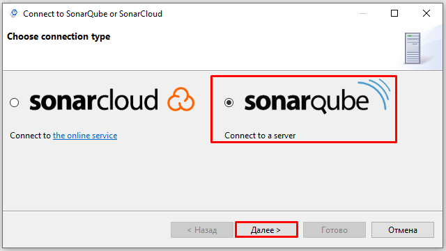

* Указываем `url` сервера SonarQube. Например, https://open.checkbsl.org/.

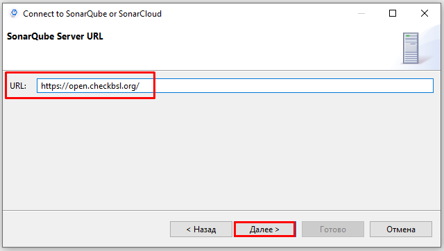

* Выбираем вариант аутентификации `Token`

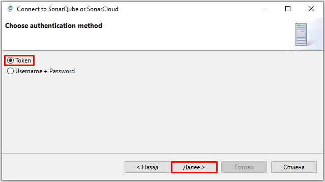

* Вводим `Token`. Если токена нет - нажимаем **Generate token** и генерируем его в SonarQube.

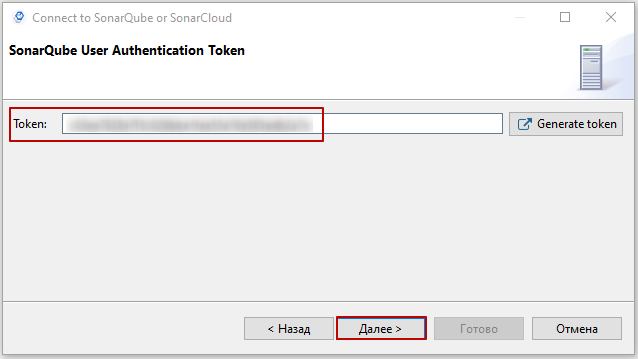

* Указываем имя соединения в поле `Connection name`. Например, open.checkbsl.org.

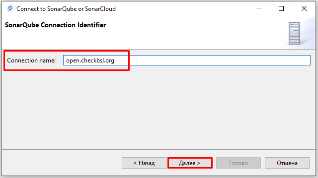

* Нажимаем **Готово** и переходим настройке к связей проектов EDT и с проектами на сервере SonarQube. 
* Связываем проект в EDT с проектом на сервере SonarQube. Нажимаем **Add (1)** , выбираем проект EDT (2) и кнопку OK (3).

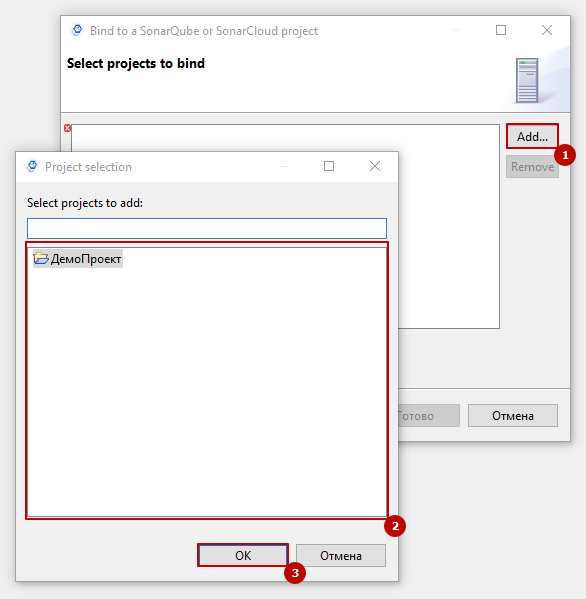

* Переходим на следующую страницу с помощью кнопки **Далее**

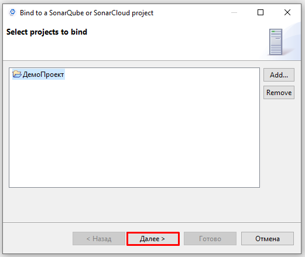

* Указываем ключ проекта на сервере SonarQube. Например, `demo-edt`. Завершаем настройку кнопкой **Готово**.

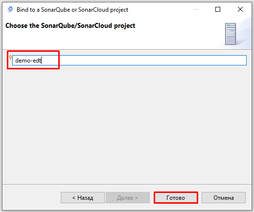

Если все сделано правильно, в окне **SonarLint Bindings** появится проект. Например:

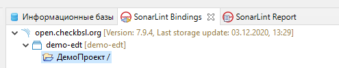

3. Запускаем анализ проекта. Для этого на объекте дерева (или на корне) вызываем контекстное меню и нажимаем **Analyze** (SonarLint -> Analyze).

Подтверждаем запуск анализа. По завершению откроется панель **SonarLint Report** со списком замечаний.

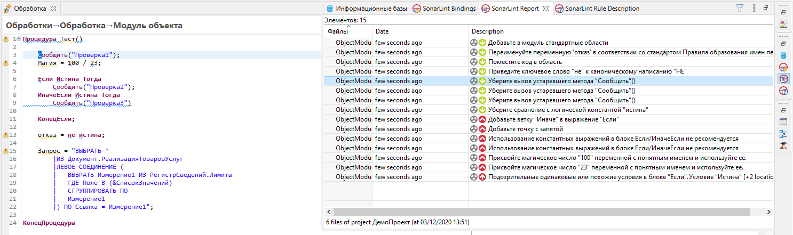

Если на замечании вызвать контекстное меню и нажать **Rule description**, то будет открыта панель с описанием правила.

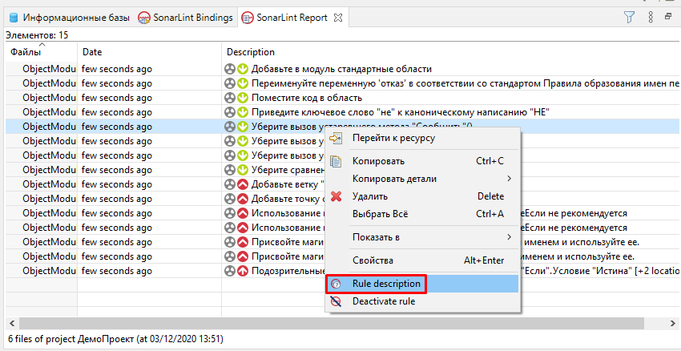

Пример описания правила **DeprecatedMethodMessage**:

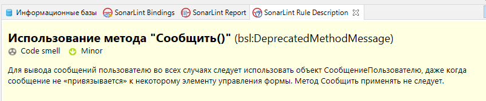